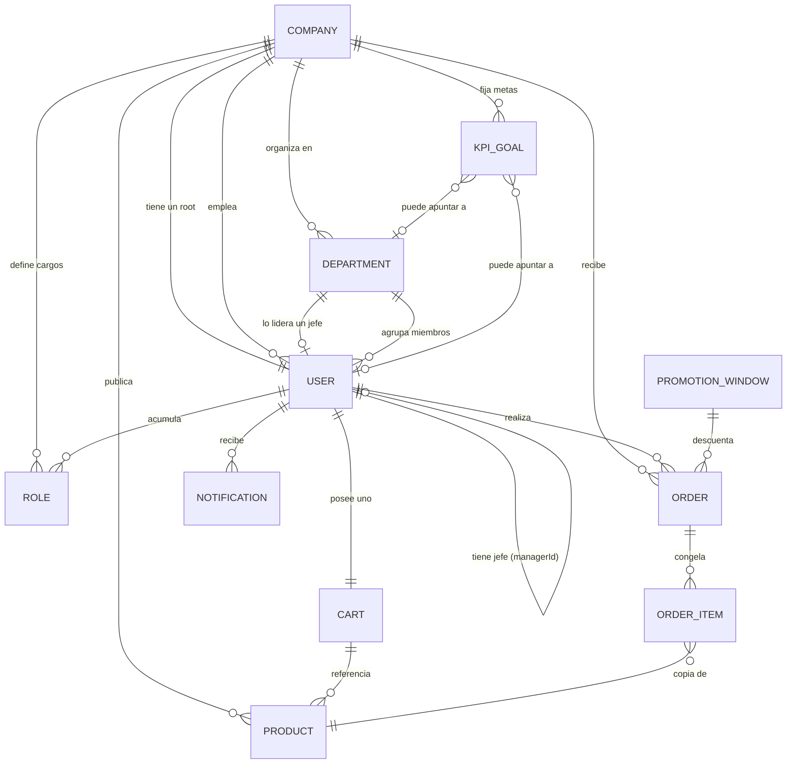
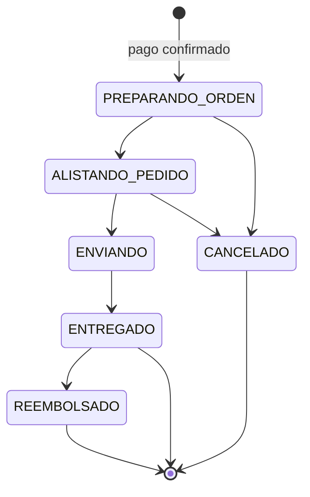
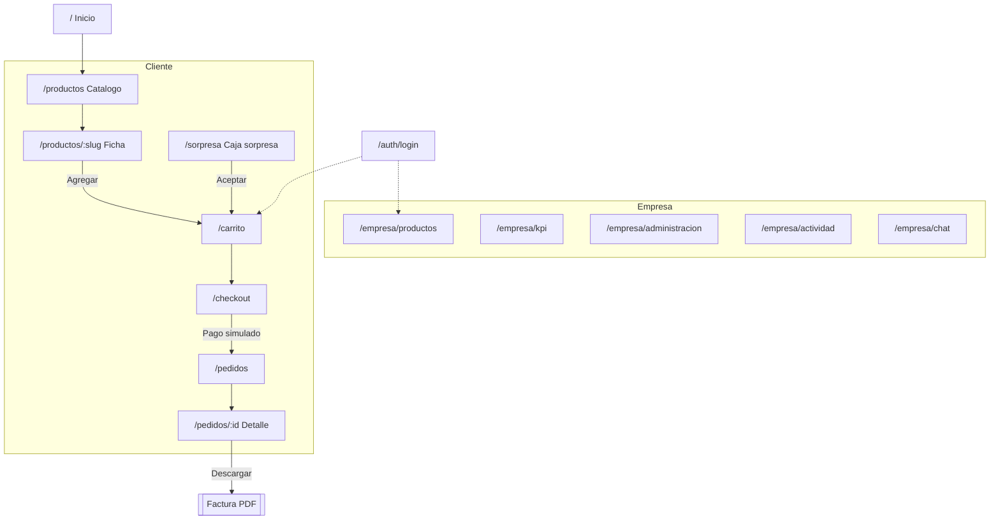
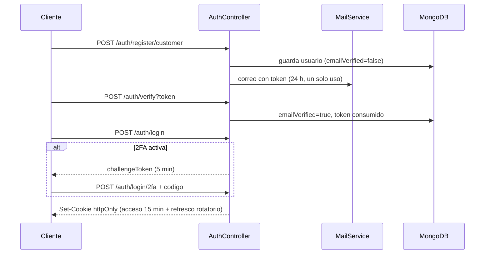
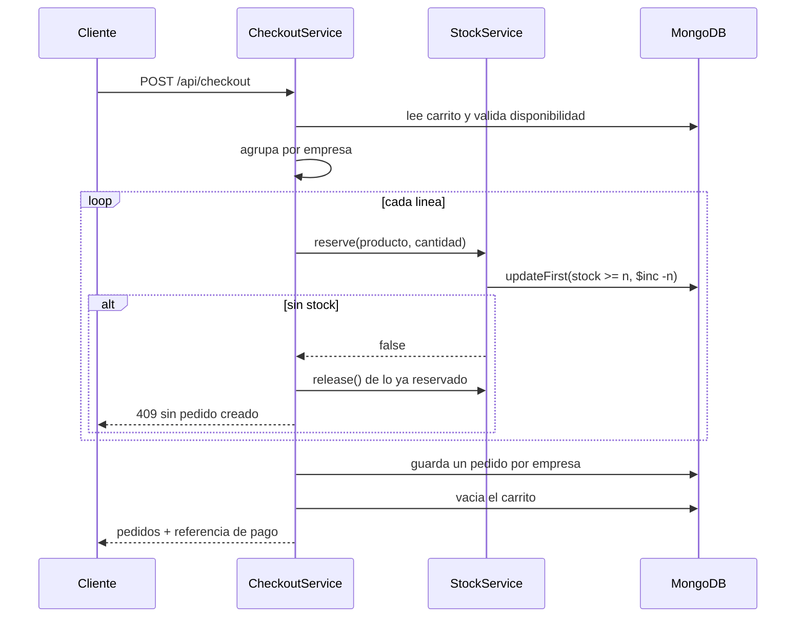
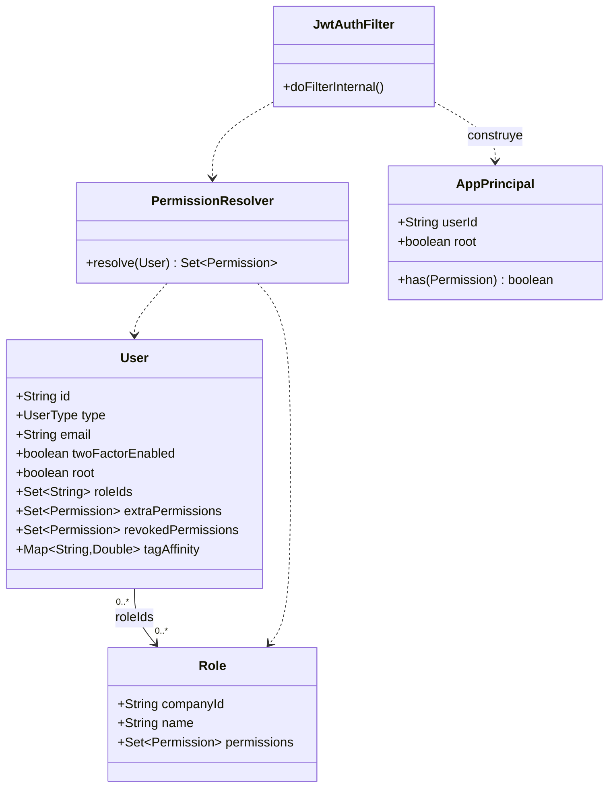
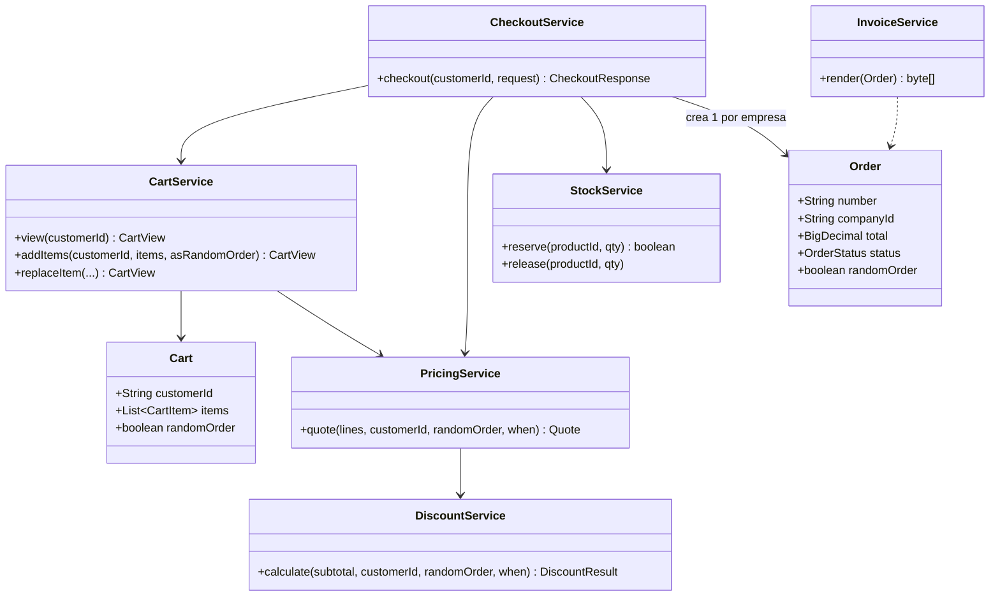
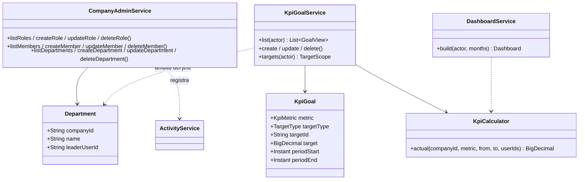
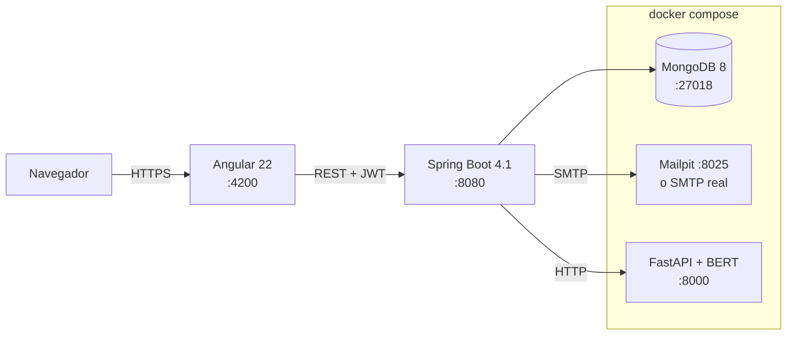

# Documentacion tecnica

---

## Introduccion

El propósito de este desarrollo es consolidar una plataforma de comercio electrónico de alta gama que trascienda la funcionalidad transaccional básica para convertirse en un ecosistema de gestión empresarial integral.

### Video presentación

[](https://www.youtube.com/watch?v=Po4HOAodkyA)

## Definición y Contextualización del Problema

El desarrollo de una plataforma de comercio electrónico contemporánea trasciende la simple creación de un catálogo digital. El problema fundamental radica en la orquestación de tres pilares críticos: 
- la integridad del inventario, 
- la fidelidad de la transacción 
- la flexibilidad de las reglas de negocio.

En este contexto, el reto no consiste solo en permitir que un usuario compre un producto, sino en garantizar que el sistema pueda reaccionar en tiempo real a condiciones variables **como ventanas de tiempo y perfiles de cliente** sin comprometer la consistencia de los datos. La problemática se profundiza al integrar un sistema de auditoría y trazabilidad, donde cada mutación del estado del sistema debe ser registrada para garantizar la transparencia operativa.

### Dimensiones del Análisis

Para entender el problema a profundidad, el proyecto se aborda desde cuatro dimensiones estratégicas:
1. **Sincronización Crítica de Inventarios:** El análisis se centra en evitar la sobreventa y garantizar la atomicidad de las operaciones. La gestión de stock no es un campo estático, sino un flujo que debe estar perfectamente sincronizado con el ciclo de vida de las órdenes de compra.
2. **Motor de Reglas de Negocio (Pricing Engine):** El desafío técnico principal es la implementación de una lógica de precios dinámica. El sistema debe ser capaz de evaluar, en el momento exacto de la persistencia de la orden, si aplica el **descuento por ventana de tiempo (10%)**, si el pedido es **aleatorio (50%)** o si el cliente posee un histórico que lo catalogue como **"frecuente" (+5%)**. La investigación aquí se enfoca en la jerarquía y el cálculo de precisión decimal para evitar errores financieros.
3. **Trazabilidad y Transparencia (Auditoría):** Se investiga el diseño de un sistema de "logs" que registre no solo el qué, sino el quién y el cuándo. Esto transforma una aplicación transaccional en un sistema empresarial auditable y seguro.

4. **Análisis Predictivo y Descriptivo (Reporting):** Los reportes solicitados (Top 5 ventas, productos activos, clientes frecuentes) no son meras listas; son el resultado de consultas complejas que buscan transformar datos crudos en información estratégica para la toma de decisiones.
### Propuesta de Solución Sistémica
El enfoque propuesto utiliza una arquitectura desacoplada donde el Backend (Spring Boot) asume la responsabilidad total de la verdad de los datos, el cumplimiento de las reglas de negocio, mientras que el Frontend (Angular/TypeScript) se enfoca en la experiencia de usuario (UX) la visualización clara de la información.
La investigación técnica se inclina por el uso de principios SOLID, diseño orientado a dominio (DDD) para asegurar que la lógica de descuentos que es el corazón de la ventaja competitiva de este modelo sea escalable, fácil de mantener. Se prioriza la seguridad desde el diseño (Security by Design) mediante una gestión de usuarios robusta y una capa de persistencia (MongoDB) optimizada para la lectura rápida de reportes y la escritura atómica de transacciones.

| Componente | Tecnologia | Puerto |
|---|---|---|
| `backend/` | Spring Boot 4.1 · Java 26 · Maven Wrapper | 8080 |
| `frontend/` | Angular 22 · TypeScript · SCSS | 4200 |
| `nlp-service/` | FastAPI · BERT multilingue | 8000 |
| Base de datos | MongoDB 8 (contenedor) | **27018** |
| Correo de pruebas | SMTP local | 1025 / 8025 |
---

# Criterios

# Historias de Usuario
### HU01: Registro de Cuenta Dual
**Como** usuario interesado,  
**quiero** poder registrarme como comprador o como empresa vendedora,  
**para** acceder a las funcionalidades específicas de mi rol en la plataforma.
*   **Criterios de Aceptación:**
    *   El registro de empresa debe crear automáticamente un usuario único con el atributo `root: true`.
    *   Se debe validar la unicidad del NIT para empresas y del Email/Username para compradores.
    *   La contraseña debe estar encriptada con BCrypt antes de persistirse.
    *   La cuenta debe crearse en estado "No verificado".
### HU02: Autenticación con Segundo Factor (MFA)
**Como** usuario preocupado por la seguridad,  
**quiero** activar la verificación en dos pasos (TOTP),  
**para** proteger mi cuenta contra accesos no autorizados.
*   **Criterios de Aceptación:**
    *   El sistema debe generar un secreto en Base32 con factor 2FA.
    *   El login debe solicitar el código de 6 dígitos solo si la 2FA está activa.
    *   Se debe implementar una comparación en tiempo constante para evitar ataques de temporización.
### HU03: Navegación por Afinidad (Etiquetas Invisibles)
**Como** comprador,  
**quiero** ver primero los productos que encajan con mis intereses,  
**para** tener una experiencia de descubrimiento fluida y personalizada.
*   **Criterios de Aceptación:**
    *   El catálogo debe ordenar los productos basándose en la coincidencia entre los `hiddenTags` del producto y el `tagAffinity` del usuario.
    *   Las etiquetas invisibles nunca deben enviarse al cliente en la respuesta JSON (seguridad por diseño).
    *   Consultar la ficha de un producto debe incrementar la afinidad del usuario por sus etiquetas de forma atómica.
### HU04: Gestión de Inventario Crítico
**Como** gestor de productos de la empresa,  
**quiero** actualizar el stock de mis artículos,  
**para** asegurar que la disponibilidad mostrada al cliente sea real.
*   **Criterios de Aceptación:**
    *   El descuento de stock en la compra debe ser una operación atómica (`$inc` con filtro `gte` cantidad).
    *   Si dos compras ocurren simultáneamente sobre la última unidad, solo una debe procesarse exitosamente.
### HU05: Pedido de Caja Sorpresa
**Como** comprador aventurero,  
**quiero** solicitar una caja sorpresa con presupuesto limitado,  
**para** obtener productos curados con un descuento agresivo.
*   **Criterios de Aceptación:**
    *   El sistema debe proponer una selección aleatoria ponderada por afinidad.
    *   Al aceptar la caja, se aplica un 50% de descuento (sumado al 10% de ventana de tiempo).
    *   Cualquier edición manual posterior del carrito debe invalidar el descuento de "sorpresa".

### HU06: Checkout Multi-Vendedor y Facturación
**Como** comprador,  
**quiero** realizar un solo pago por productos de distintas tiendas,  
**para** simplificar mi proceso de compra.
*   **Criterios de Aceptación:**
    *   El checkout debe dividir el carrito en N pedidos independientes, uno por empresa.
    *   Se debe generar una factura PDF minimalista por cada pedido con diseño editorial (fuente Inter, fondo crema).
    *   El envío se cobra una vez por empresa, a menos que se supere el umbral de envío gratuito.
### HU07: Administración de Jerarquías y Equipos
**Como** usuario Root de la empresa,  
**quiero** crear departamentos y asignar jefes de equipo,  
**para** modelar la estructura operativa de mi compañía.
*   **Criterios de Aceptación:**
    *   Se debe permitir la asignación de un `managerId` a los usuarios.
    *   El sistema debe impedir que un usuario sea su propio jefe o que se creen ciclos de mando.
    *   Al eliminar un departamento, los miembros deben quedar sin departamento asignado (evitar referencias rotas).
### HU08: Auditoría de Acciones de Gestión
**Como** administrador root,  
**quiero** visualizar un registro de toda la actividad de mis empleados,  
**para** garantizar la transparencia y trazabilidad de la gestión.
*   **Criterios de Aceptación:**
    *   Cada mutación (creación, edición, cambio de estado) debe generar un `ActivityLog`.
    *   El log debe capturar: timestamp, usuario, acción, recurso afectado y metadatos del cambio.
### HU09: Priorización de Casos mediante IA
**Como** agente de soporte,  
**quiero** que el sistema destaque automáticamente los casos más urgentes o negativos,  
**para** atender primero los asuntos críticos.

*   **Criterios de Aceptación:**
    *   Cada nuevo caso debe enviarse al microservicio NLP para obtener prioridad y sentimiento.
    *   Si el servicio NLP no responde, el sistema debe degradarse a una heurística local basada en palabras clave de urgencia.
    *   El SLA de vencimiento debe calcularse dinámicamente según la prioridad (ej: Alta = 24h, Baja = 72h).
### HU10: Monitoreo de Metas KPI
**Como** jefe de departamento,  
**quiero** fijar metas de desempeño para mi equipo,  
**para** medir el rendimiento real frente a los objetivos estratégicos.
*   **Criterios de Aceptación:**
    *   El valor "cumplido" de la meta debe calcularse en vivo (no almacenarse) sobre pedidos y casos reales.
    *   Las visualizaciones deben usar componentes SVG nativos (barras, líneas, donas).
    *   Un jefe solo puede ver y gestionar metas de su departamento o de las personas que tiene a cargo.


## 1. Objetivos

### 1.1. Ingeniería de Precisión Financiera
Implementar un motor de cálculo de alta fidelidad que garantice la integridad de los datos monetarios mediante el uso de `BigDecimal` con operaciones atómicas de stock, eliminando errores de redondeo y previniendo la sobreventa en entornos de alta concurrencia.

### 1.2. Concepto de facil naveagilidad
Consolidar una identidad visual inspirada en el diseño editorial contemporáneo simple, facil, rapido de entender. El sistema debe priorizar la serenidad del usuario mediante el minimalismo, eliminando el ruido visual para destacar el producto y la información analítica.

### 1.3. Clasificación Estratégica mediante IA
Integrar modelos de procesamiento de lenguaje natural Transformers (BERT) para filtrar casos del soporte técnico, es una herramienta de decisión estratégica, permitiendo la priorización automática de casos según el sentimiento y la urgencia semántica.

### 1.4. Modelado Organizacional Profundo
Proveer una infraestructura de administración que no solo gestione usuarios, sino que permita modelar la estructura real de una empresa: cargos granulares, departamentos con liderazgo definido y jerarquías de mando trazables.

### 1.5. Analítica 
Desarrollar un sistema de visualización de indicadores KPI basado en gráficas, asegurando el máximo rendimiento.

### Planteamiento de desarrollo

Al entender el proyecto se decide construir **por fases**. Cada una se verifica de punta a punta antes de darse por
cerrada.

| Fase | Alcance | Tiempo de desarrollo (MAXIMO) por etapas |
|---|---|---|
| 1 | Cimientos, autenticacion, RBAC y catalogo | 24 horas | 
| 2 | Carrito, checkout, descuentos y factura | 12 horas| 
| 3 | Gestion de pedidos por la empresa, estados y reembolsos | 12 horas| 
| 4 | Casos de atencion con BERT, comentarios al vendedor y chat | 6 horas | 
| 5 | Administracion de la empresa: cargos, usuarios, departamentos, equipos, metas KPI, graficas y chat de equipo | 24 horas| 
| 6 | Desarrollo final de procesos visuales | 8 horas |
| 7 | Correcion de errores | 10 horas|


## 2. Objetivos

### Funcionales

1. **Dos categorias de cuenta** con registro y verificacion de correo obligatoria.
2. **Niveles de acceso personalizables**: cada empresa define cargos y ajusta permisos por persona.
3. **Gestion de producto e inventario** desde un panel propio de cada empresa.
4. **Priorizacion personalizada** del catalogo mediante etiquetas invisibles.
5. **Compra completa**: carrito, impuestos, envio, descuentos, pago simulado y factura.
6. **Descuentos parametrizados**: 10% por ventana de tiempo, 50% por pedido aleatorio y 5% por
   cliente frecuente.
7. **Trazabilidad**: estado de entrega, historial de pedidos y registro de actividad.
8. **Administracion por root**: cargos, usuarios, departamentos con jefes y equipos (un jefe puede
   tener jefe), y personalizacion de acceso por proceso de gestion.
9. **Metas KPI e indicadores**: metas por empresa, departamento o persona, con su progreso calculado
   sobre los datos reales, y un panel de graficas de gestion.

### Tecnicos

- **Dinero sin errores de redondeo**: `BigDecimal` en todo el calculo, nunca `double`.
- **Sin sobreventa** aunque dos compras coincidan en el ultimo articulo.
- **Seguridad por defecto**: permisos recalculados en cada peticion, secretos fuera del repositorio,
  y ningun dato sensible expuesto en las respuestas publicas.
- **Verificacion real**: cada fase se prueba recorriendo el flujo del cliente, no solo compilando.

---

## 3. Modelo de dominio

### Entidades y relaciones



### Colecciones de MongoDB

| Coleccion | Proposito | Indices relevantes |
|---|---|---|
| `users` | Documento unico para ambos tipos, con discriminador `type` | `email` unico; `username` unico **parcial**; `(companyId, root)` unico parcial |
| `companies` | Empresa vendedora | `nit` unico |
| `roles` | Cargos: plantillas de permisos | `companyId` |
| `departments` | Departamentos con su jefe; la pertenencia vive en `User.departmentId` | `companyId` |
| `kpiGoals` | Metas KPI; el valor cumplido no se almacena, se calcula al consultar | `(companyId, targetType, targetId)` |
| `products` | Catalogo | `slug` unico; `(active, createdAt)`; indice de texto en español |
| `carts` | Un carrito por cliente | `customerId` unico |
| `orders` | Pedido a **una sola** empresa | `number` unico; `(companyId, status, createdAt)` |
| `promotionWindows` | Rango de tiempo con descuentos | `(active, startsAt, endsAt)` |
| `refundRequests` | Solicitudes de reembolso, con ciclo propio | `(companyId, status, createdAt)`; `customerId` |
| `supportCases` | Casos de atencion, con los mensajes embebidos | `number` unico; `(companyId, status, dueDate)`; `customerId` |
| `chatMessages` | Chat general, comunicados de root y chats de departamento (canal `dept:<id>`) | `(companyId, channel, createdAt)` |
| `counters` | Numeracion atomica de pedidos, facturas y casos | clave primaria |
| `verificationTokens`, `refreshTokens` | Tokens de un solo uso | TTL sobre `expiresAt` |
| `notifications`, `activityLog` | Avisos y trazabilidad | por destinatario / por empresa |

### Reglas de negocio

**Usuario root unico por empresa.** Garantizado por un indice parcial unico sobre
`(companyId, root: true)`. No depende de una comprobacion en codigo, que fallaria bajo concurrencia.

**Permisos efectivos** = union de los cargos + concedidos individualmente − revocados individualmente.
El root los tiene todos de forma implicita. Se recalculan en **cada peticion**, de modo que un cambio
de cargo aplica al instante y no al caducar el token.

**Etiquetas invisibles.** Cada producto lleva `hiddenTags` y cada cliente acumula `tagAffinity` al
consultar fichas. El catalogo ordena por esa afinidad. Las etiquetas **nunca** se serializan hacia el
navegador: solo alimentan el orden.

**Un pedido por empresa.** Un carrito con productos de varios vendedores se divide al pagar. Cada
pedido tiene su numero, su estado y su factura, y el pago es unico y comparte referencia. Sin esta
division, dos empresas competirian por un mismo campo de estado en la Fase 3.

**El carrito no guarda precios.** Solo `productId` y `quantity`; el resto se lee del catalogo en cada
consulta. Asi un cambio de precio se refleja al instante y no hay dos copias que sincronizar. Los
importes se congelan **al crear el pedido**, para que una factura emitida no cambie nunca.

**Estados del pedido**



Las transiciones las gestiona la empresa, y las declara el propio enum `OrderStatus`, no el
servicio: la regla vive junto al dato que gobierna y no puede saltarsela quien llame por otra via.
El avance es secuencial, **cancelar** solo cabe antes de que salga el paquete, y **reembolsar** solo
despues de entregar —cuando el cliente puede saber que "no era lo esperado"—. Cancelar y reembolsar
**devuelven la mercancia al catalogo**.

Los productos de un pedido solo se pueden cambiar mientras no haya salido; al hacerlo, los importes
se recalculan conservando el porcentaje de descuento original y la diferencia queda registrada como
**saldo de ajuste**.

**Departamentos y jerarquia (Fase 5).** Un departamento agrupa personas y tiene un jefe opcional. La
pertenencia no se guarda como una lista en el departamento, sino en `User.departmentId`: un solo sitio
que consultar y sin listas que sincronizar al mover a alguien. La jerarquia de mando es
independiente y vive en `User.managerId` —"un jefe puede tener jefe"—, con guardas que impiden que
alguien sea su propio jefe o que se forme un ciclo directo. Al eliminar a un usuario, sus
subordinados quedan sin jefe y los departamentos que lideraba, sin lider, en lugar de conservar
referencias rotas.

**Metas KPI calculadas, no almacenadas.** Una meta guarda solo su objetivo, su periodo y a quien
apunta (empresa, departamento o persona). El **valor cumplido se calcula al consultar**, sobre los
pedidos y casos reales del periodo: guardarlo obligaria a recalcularlo con cada cambio de pedido o
caso, y quedaria desincronizado en cuanto algo cambiara por otra via. Las **ventas** solo tienen
sentido a nivel de empresa o departamento —quien compra es el cliente, no el personal—; las metricas
de gestion (casos resueltos, a tiempo, atendidos, pedidos entregados) si pueden apuntar a una persona.

**Ambito del jefe.** Root gestiona cualquier meta de su empresa; un jefe solo las de su departamento
y las de las personas de ese departamento, como pide la especificacion. La misma regla decide que
metas ve cada quien.

---

## 4. Referencias visuales

## Narrativa visual

El universo visual de esta plataforma de comercio electrónico se concibe como una obra de arte digital donde la ingeniería de software y la estética minimalista convergen en un diálogo de serenidad, calidez y precisión. Inspirado en la sofisticación editorial de Beauty in Stem, el aplicativo rechaza la frialdad del blanco digital para adoptar una base de tono crema orgánica que envuelve cada interacción, proporcionando una superficie táctil y lujosa que reduce la fatiga visual. Esta atmósfera se complementa con una arquitectura de información que bebe de la claridad quirúrgica de Hirotos, donde el espacio en blanco no se percibe como vacío, sino como una herramienta activa de diseño que guía el ojo hacia la nobleza del producto. El texto, ejecutado con la tipografía Inter servida localmente, se despliega con un ritmo pausado, utilizando micro etiquetas en mayúsculas con un espaciado generoso entre caracteres para jerarquizar los bloques de datos, infundiendo un aire de sofisticación que recuerda a las publicaciones de diseño de alta gama y a la estructura limpia y funcional que propone Take Boost para entornos de alta productividad.
El dinamismo del sitio encuentra su punto álgido en una experiencia inmersiva que evoca la maestría técnica de Unseen Studio, particularmente visible en la sección hero de la página de inicio. Aquí, una lluvia constante de cajas tridimensionales en tonos kraft desciende con una física elegante y coreografiada; estos cubos, construidos íntegramente mediante CSS puro, representan la tangibilidad del proceso logístico y la robustez del inventario, rebotando y abriendo sus solapas en un juego de sombras que rompe la bidimensionalidad de la pantalla. Esta audacia interactiva se traslada al catálogo con una transición fluida hacia el minimalismo pragmático, donde las fotografías de los productos descansan sobre fondos planos y neutros. Siguiendo la filosofía visual de Hirotos, en ausencia de imagen, el sistema genera automáticamente una representación tipográfica basada en la inicial del artículo, asegurando que la rejilla visual mantenga su armonía geométrica y su equilibrio estético en todo momento.
La interactividad sutil es el lenguaje con el que la aplicación se comunica con el usuario, empleando botones de diseño minimalista: rectángulos de bordes finos y radios de apenas dos píxeles que invierten sus colores al contacto con el cursor, un gesto de respuesta inmediata que emula la precisión de las interfaces de Take Boost. Bajo esta piel de diseño, existe una capa de inteligencia invisible donde los modelos BERT de procesamiento de lenguaje natural y los algoritmos de afinidad por etiquetas dictan el orden del contenido. Aunque el ojo del comprador nunca ve estas marcas técnicas, la disposición del catálogo se reorganiza de forma orgánica, creando una coreografía visual personalizada donde lo más deseado emerge a la superficie con la misma naturalidad con la que se navegan las curadurías de Beauty in Stem. Esta transparencia se extiende al carrito de compra y al proceso de pago, donde el uso de cálculos de alta precisión se traduce en una interfaz de honestidad matemática, libre de errores de redondeo, donde cada descuento y cada impuesto se justifica con una claridad editorial absoluta.
En el panel de gestión empresarial, la complejidad administrativa se transforma en una exhibición de claridad analítica y diseño de vanguardia. Los indicadores KPI se alejan de las librerías genéricas para presentarse a través de gráficas SVG dibujadas a mano, donde barras, líneas y donas narran el rendimiento de la compañía con la misma elegancia cromática que el resto del ecosistema. Los medidores de progreso, inspirados en la visualización de datos de alto rendimiento que se observa en los proyectos de Unseen Studio, ofrecen una lectura instantánea de las metas alcanzadas mediante agujas de trazo fino y sombras sutiles. Finalmente, la coherencia de este universo se proyecta hacia el exterior mediante los correos transaccionales y la factura PDF, los cuales heredan el mismo ADN visual. El fondo crema, las microetiquetas, la tipografía Inter. En su conjunto, la plataforma no solo se erige como una herramienta técnica de alta ingeniería con procesos atómicos de inventario y seguridad por defecto, sino como una pieza de arte digital coherente y predecible, donde la tecnología se vuelve invisible para dejar paso a una experiencia de usuario fluida, humana y profundamente estética.

## Referencias visuales
| Nombre | Referencia |
|---|---|
|Horotos.com | https://www.hirotos.com/ |
| beatyinstem |https://beautyinstem.com/ |
| takeboost | https://takeboost.com/ |
| unseestudio | https://www.awwwards.com/unseenstudio/ |
## Paleta de color:

# 1. Colores de Fondo (Ambiente)
` Crema Base (--bg): #F7F4EF `
Es el color predominante. Sustituye al blanco puro para dar una sensación orgánica, cálida y de "papel de alta calidad".
` Blanco Superficie (--surface): #FFFFFF `
Utilizado exclusivamente para elevar elementos sobre el fondo, como tarjetas de productos, paneles de control y el cuerpo de la factura.
# 2. Tipografía y Detalles (Tinta)
` Negro Obsidiana (--ink): #1A1A1A`
Utilizado para el texto principal, encabezados h1 y botones primarios. Aporta un contraste fuerte y legible.
`Gris Piedra (--ink-muted): #6B6862`
Color para textos secundarios, microetiquetas (en mayúsculas) y pies de página. Reduce la jerarquía visual sin perder legibilidad.
# 3. Acentos y Estados (Identidad)
`Verde Salvia (--accent): #A8B5A0`
El color de marca. Se usa para estados positivos, insignias de "Disponible", barras de progreso KPI y elementos destacados que no deben ser agresivos.
`Arena Suave (--accent-soft): #E8DED3`
Utilizado para fondos de etiquetas, avisos sutiles y hover de botones secundarios. Une el crema del fondo con el gris del texto.
# 4. Estructura (Líneas)
`Lino (--line): #E3DDD4`
Color para bordes de tablas, separadores entre secciones y bordes de botones. Es casi imperceptible, manteniendo la estética de "espacio en blanco".
# 5. Semántica (Alertas)
`Rojo Terracota (--danger): #A5453A`
Errores, cancelaciones o stock agotado. Es un rojo apagado para no romper la armonía minimalista.
`Verde Bosque (--success): #4F7A52`
Confirmaciones de pago, registros exitosos y reembolsos aprobados.


La coherencia se extiende fuera de la aplicacion: **los correos transaccionales y la factura PDF**
usan la misma paleta y el mismo recurso de microetiquetas.

---

## 5. Estructura UX

### Mapa de navegacion



### Decisiones de experiencia

**El servidor manda en los importes.** El carrito no calcula nada en el navegador: cada cambio de
cantidad devuelve los totales recalculados. Evita que el cliente vea un precio y pague otro.

**Los bloqueos se explican.** Si un producto se agota o se retira, la linea permanece marcada con el
motivo en lugar de desaparecer, y el boton de pagar se inhabilita. Borrarla en silencio dejaria al
cliente sin entender por que cambio su total.

**El descuento se ve antes de pagar.** Al aceptar una caja sorpresa el carrito muestra el desglose
completo, con un aviso de que editarlo hace perder el 50%.

**Los permisos se reflejan en la interfaz.** La directiva `*hasPermission` oculta las acciones no
permitidas. Es solo cortesia visual: el backend vuelve a comprobarlo y responde 403.

**Responsive de 4 a 1 columnas.** Rejilla de catalogo 4 → 2 → 1 segun ancho; ninguna pagina desborda
horizontalmente. Las tablas anchas hacen scroll dentro de su contenedor.

**Graficas propias, sin libreria.** El panel KPI dibuja sus barras, lineas, dona y medidores en
**SVG a mano**, con los mismos tokens del sistema de diseño. Es coherente con la postura del proyecto
de no arrastrar dependencias de frontend, y evita cargar una libreria de graficas entera para cinco
figuras. Cada grafica es un componente reutilizable (`app-bar-chart`, `app-line-chart`,
`app-donut-chart`, `app-gauge`) que recibe una lista de puntos.

### Pantallas

| Ruta | Acceso | Contenido |
|---|---|---|
| `/` | Publico | Hero, los cuatro pasos y seleccion destacada |
| `/productos` | Publico | Filtros, busqueda, paginacion y orden personalizado |
| `/productos/:slug` | Publico | Ficha, stock y alta al carrito |
| `/auth/*` | Invitado | Login con 2FA, registro de usuario y de empresa, verificacion |
| `/carrito` | Cliente | Lineas, cantidades, sustitucion y resumen |
| `/checkout` | Cliente | Envio, casilla de regalo y pago simulado |
| `/sorpresa` | Cliente | Caja sorpresa con presupuesto |
| `/pedidos`, `/pedidos/:id` | Cliente | En proceso e historial; linea de tiempo y factura |
| `/cuenta` | Autenticado | Datos, contrasena, 2FA y baja |
| `/notificaciones` | Autenticado | Avisos |
| `/empresa/productos` | Empresa | Panel de catalogo e inventario |
| `/empresa/pedidos`, `/empresa/pedidos/:id` | Empresa | Panel por prioridad; detalle con cambio de estado y de productos |
| `/empresa/reembolsos` | Empresa | Solicitudes recibidas, con aprobacion o rechazo |
| `/casos`, `/casos/:id` | Cliente | Mis casos y su conversacion; se abren desde el pedido |
| `/empresa/casos`, `/empresa/casos/:id` | Empresa | Bandeja priorizada por BERT; atender, asignar y responder |
| `/empresa/kpi` | Empresa (KPI) | Panel de indicadores con graficas SVG y gestion de metas con su progreso |
| `/empresa/administracion` | Empresa (root) | Cargos, usuarios y departamentos, en tres pestañas; ajuste fino de permisos por persona |
| `/empresa/actividad` | Empresa (`ACTIVITY_VIEW`) | Registro de la actividad de gestion, filtrable por usuario |
| `/empresa/chat` | Empresa | Chat general, comunicados de root y chat privado por departamento o equipo |

---

## 6. Funcionamiento del backend

### Autenticacion



El **acceso** viaja en JWT firmado con HS256. El **refresh** es opaco y se guarda solo como hash: una
filtracion de la coleccion no permite suplantar sesiones. Cada uso lo rota.

### La sesion vive en cookies httpOnly

Ni el token de acceso ni el de refresco llegan al cuerpo JSON: se emiten como **cookies
`httpOnly`**, que el navegador adjunta sola pero **JavaScript no puede leer**. Esa es toda la
diferencia: guardarlos en `localStorage` los dejaba al alcance de cualquier script de la pagina, de
modo que un XSS bastaba para robar la sesion. Con `httpOnly` no hay nada que robar desde la pagina.

| Cookie | Ruta | Vida | Visible para JS |
|---|---|---|---|
| `ecommerce_access` | `/` | 15 min | No (`httpOnly`) |
| `ecommerce_refresh` | `/api/auth` | 7 dias | No (`httpOnly`) |
| `XSRF-TOKEN` | `/` | sesion | **Si**, a proposito |

La de refresco se limita a `/api/auth`: solo acompaña a renovar y cerrar sesion, en vez de viajar en
cada peticion de la API.

**CSRF pasa a ser necesario.** Cuando la credencial viaja en cookie, el navegador la adjunta tambien
a las peticiones que provoque otro sitio, asi que se activa la proteccion de Spring Security: el
servidor emite `XSRF-TOKEN` en una cookie **legible** y exige recibir ese mismo valor en la cabecera
`X-XSRF-TOKEN`. Un sitio ajeno no puede leer la cookie —lo impide la politica del mismo origen— y por
tanto no puede fabricar la cabecera. `SameSite=Lax` es la primera barrera y esto la segunda. Se
exceptuan login, registro, verificacion y recuperacion: no hay sesion previa que proteger y son el
punto donde el cliente aun no tiene el token.

**El navegador no guarda nada de la sesion.** Como no puede leer la cookie, al recargar no sabe quien
es: por eso existe `GET /api/auth/session`, que devuelve el usuario a partir de la cookie. La
aplicacion lo consulta al arrancar, antes de evaluar las guardas de ruta. Lo unico que queda en el
navegador es el recordatorio de 2FA en `sessionStorage`, que es una preferencia de presentacion.

El filtro sigue admitiendo `Authorization: Bearer` para Swagger, scripts y pruebas. Eso no debilita
nada: un XSS no puede leer la cookie y, por tanto, tampoco construir ese encabezado.

La **verificacion en dos pasos** implementa TOTP (RFC 6238) sin dependencias externas, con tolerancia
de un paso de reloj y comparacion en tiempo constante.

### Motor de descuentos

Tres reglas, con dos decisiones que conviene tener presentes:

1. **La ventana condiciona a las tres.** La especificacion dice que *"los descuentos"* —en plural—
   solo aplican dentro del rango, asi que fuera de la ventana no se aplica ninguno, ni siquiera el de
   cliente frecuente.
2. **Se suman, no se encadenan.** El 5% se describe como *"adicional"*, propio de una suma. Techo
   configurable del 65%.

```
si no hay ventana activa  ->  0%
si la hay                 ->  10% + (50% si sorpresa) + (5% si frecuente), con techo del 65%
```

La condicion de **pedido sorpresa vive en el carrito**, no en la peticion de pago: asi el descuento
se ve desde que se acepta la caja y ningun cliente puede concederselo enviandolo a mano. Cualquier
edicion manual del carrito la desactiva.

### Calculo de totales

El orden de las operaciones decide cuanto se paga, y se fija en un solo sitio:

```
subtotal       = suma de (precio unitario x cantidad)
descuento      = subtotal x porcentaje acumulado
base imponible = subtotal - descuento
IVA            = base imponible x 19%        (sobre la base ya descontada)
envio          = 0 si base >= umbral, si no tarifa plana   (una vez por empresa)
total          = base imponible + IVA + envio
```

### Pago



**Sin sobreventa.** La resta de stock es una unica operacion atomica cuyo filtro exige que queden
unidades suficientes. Leer, restar en memoria y guardar seria una condicion de carrera: dos compras
simultaneas del ultimo articulo leerian el mismo valor y ambas creerian haberlo conseguido.

**Compensacion manual.** MongoDB corre como nodo suelto, sin transacciones multidocumento, asi que si
algo falla a mitad se devuelve a mano el stock ya reservado.

### Gestion del pedido por la empresa (Fase 3)

El panel de la empresa ordena los pedidos por los criterios que pide la especificacion —fecha,
vencimiento, cantidad y estado— mas una **prioridad calculada** (`VENCIDO`, `POR_VENCER`, `NORMAL`)
que responde a la pregunta real de quien gestiona: que atender primero. La prioridad no es un campo
almacenado, asi que ese orden se resuelve en memoria sobre un conjunto acotado; el resto se pagina en
la base de datos.

**Toda modificacion avisa al cliente por correo y por notificacion**, como exige la especificacion.
El aviso se centraliza en `OrderManagementService`, no en cada controlador, para que no se olvide en
ningun camino.

Al **cambiar los productos** de un pedido pagado se reserva primero lo que aumenta y solo despues se
libera lo que se reduce, de modo que un fallo de stock no deje el pedido a medias. Los importes se
recalculan **conservando el porcentaje de descuento con el que se compro**: volver a consultar el
motor daria otro resultado si la promocion ya cerro, y el cliente perderia una rebaja ya ganada.

Los **reembolsos** se solicitan sobre pedidos entregados y dentro de un plazo configurable. Al
aprobarlos, el pedido pasa a `REEMBOLSADO` y la mercancia vuelve al catalogo; al rechazarlos, se
queda como estaba. Un pedido no puede acumular dos solicitudes abiertas a la vez.

### Casos de atencion con BERT (Fase 4)

Un **caso** es un hilo entre un cliente y una empresa. Resuelve a la vez los dos requisitos: por el
lado del cliente, "realizar comentarios o peticiones al vendedor"; por el de la empresa, la "pestana
de atencion" que un modelo BERT ordena por prioridad, fecha y vencimiento.

**Al abrir el caso se clasifica con el microservicio BERT** (`nlp-service`, ya desplegado desde la
Fase 1). De su respuesta salen la prioridad (`HIGH`/`MEDIUM`/`LOW`), el sentimiento y —lo mas util—
el **vencimiento del SLA**, mas corto cuanto mas urgente: 24h para alta, 48h para media, 72h para
baja, todo configurable. Asi la bandeja nace ordenada por lo que no puede esperar. La clasificacion
se guarda en la apertura: recalcularla en cada listado seria caro y volatil, y el orden debe ser
estable.

El cliente `CasePrioritizationClient` **se degrada a una heuristica local** (vencimiento, antiguedad
y palabras clave) si el microservicio no responde, de modo que abrir un caso nunca falla por un
servicio auxiliar. El caso recuerda si lo clasifico el modelo o la heuristica.

El caso tiene su propia maquina de estados —`ABIERTO`, `EN_ATENCION`, `ESPERANDO_CLIENTE`,
`RESUELTO`, `CERRADO`— con reglas: responder deja el caso a la espera del cliente, y que el cliente
conteste a un caso resuelto lo reabre. Cada respuesta de la empresa avisa al cliente por notificacion.

### Chat interno y comunicados (Fase 4)

El **chat general** de la empresa lo lee todo el personal, pero solo publican quienes root autoriza
(`CHAT_GENERAL_POST`); el resto tiene acceso de lectura. Los **comunicados de root**
(`BROADCAST_SEND`) aparecen en el mismo hilo, destacados, y ademas generan una notificacion a cada
miembro: es informacion que debe llegar a todos, no depender de que abran el chat.

Los **chats por departamento o equipo** (Fase 5) reutilizan la misma coleccion: cada canal se nombra
`dept:<id>` sobre el campo `channel` que ya estaba reservado, sin migrar nada. A diferencia del chat
general, aqui no hace falta un permiso para escribir: el chat de equipo es privado y la barrera es la
**pertenencia** —lo ven y publican los miembros del departamento, su jefe y root—. La interfaz ofrece
un selector de canales que solo lista los departamentos accesibles para quien mira.

### Administracion de la empresa (Fase 5)

Root administra su empresa desde un mismo servicio (`CompanyAdminService`), con cada competencia tras
su propio permiso para poder repartirlas entre cargos:

- **Cargos** (`ROLE_MANAGE`): crear, modificar y eliminar plantillas de permisos. Los cargos del
  sistema no se borran, y al eliminar un cargo se retira de quien lo tuviera para no dejar referencias
  colgando.
- **Usuarios** (`USER_MANAGE`): crear e invitar por correo (sin contrasena utilizable hasta que la
  fije desde el enlace), modificar cargos, departamento, jefe y **permisos individuales** concedidos o
  revocados sobre los cargos, y eliminar. No se puede eliminar al root ni eliminarse a uno mismo.
- **Departamentos** (`DEPARTMENT_MANAGE`): crear, modificar, asignar jefe y eliminar; al eliminar, sus
  miembros quedan sin departamento.
- **Actividad** (`ACTIVITY_VIEW`): consultar el registro de acciones de gestion de la empresa,
  opcionalmente filtrado por usuario.

Cada mutacion se anota en el **registro de actividad**, de modo que el visor refleje quien hizo que.

### Metas KPI y panel de indicadores (Fase 5)

El valor real de cada metrica lo calcula `KpiCalculator` **sobre los datos que ya existen** —pedidos y
casos— en el periodo y el ambito pedidos, sin almacenar nada. `KpiGoalService` fija las metas y
resuelve su progreso (`actual / objetivo`), aplicando el ambito del jefe. `DashboardService` arma el
panel: ventas por mes, casos por estado, productos mas vendidos, y casos por departamento y por
persona, todo del periodo elegido. Un endpoint de **objetivos** devuelve a cada quien solo los
departamentos y usuarios que puede fijar como meta, para que un jefe sin `USER_MANAGE` pueda armar sus
metas sin ver toda la plantilla.

### Notas de plataforma

Dos comportamientos de Spring Boot 4 que costaron tiempo y conviene dejar por escrito:

- La conexion a Mongo se configura en **`spring.mongodb.*`**, no en `spring.data.mongodb.*`. La
  antigua ya no controla el servidor, y el valor por defecto de la nueva es `mongodb://localhost/test`:
  configurarlo en el sitio equivocado hace que la aplicacion escriba en la base `test` sin avisar.
- Spring Boot **no lee `.env`** de forma nativa. Se importa con
  `spring.config.import: optional:file:../.env[.properties]`.

---

## 7. Documentacion por clases

### `com.ecommerce.security`

| Clase | Responsabilidad |
|---|---|
| `Permission` | Enum de permisos granulares por proceso, agrupados para la interfaz |
| `PermissionResolver` | Calcula los permisos efectivos: cargos + concedidos − revocados; root los tiene todos |
| `JwtService` | Emite y valida los JWT; genera y hashea los refresh tokens |
| `SessionCookieService` | Emite y retira las cookies `httpOnly` de sesion, y las lee de la peticion |
| `JwtAuthFilter` | Toma el token de la cookie (o del encabezado) y recarga el usuario en cada peticion |
| `TotpService` | TOTP propio (RFC 6238), con base32 y verificacion en tiempo constante |
| `AppPrincipal` | Usuario autenticado tal como lo ven los controladores |

### `com.ecommerce.auth` · `com.ecommerce.user` · `com.ecommerce.company`

| Clase | Responsabilidad |
|---|---|
| `AuthService` | Registro de cliente y empresa, verificacion, sesion, 2FA y contrasena |
| `UserService` | Perfil, cambio de contrasena, alta y baja de 2FA, y baja de cuenta con anonimizacion |
| `User` | Documento unico para ambos tipos, discriminado por `type`; `departmentId` y `managerId` |
| `Company` / `Role` | Empresa y cargos (plantillas de permisos) |
| `Department` | Departamento con su jefe; la pertenencia vive en `User.departmentId` |
| `CompanyAdminService` | Administracion por root: cargos, usuarios, departamentos, con guardas e invitacion por correo |

### `com.ecommerce.kpi`

| Clase | Responsabilidad |
|---|---|
| `KpiMetric` | Metricas disponibles, con su unidad (moneda/conteo) y su ambito |
| `KpiGoal` | Meta: objetivo, periodo y a quien apunta; no guarda el valor cumplido |
| `KpiCalculator` | Calcula el valor real de cada metrica sobre pedidos y casos, al consultar |
| `KpiGoalService` | Crea, lista y borra metas con su progreso; aplica el ambito del jefe |
| `DashboardService` | Arma las series del panel: ventas, casos, productos, por departamento y por persona |

### `com.ecommerce.catalog`

| Clase | Responsabilidad |
|---|---|
| `Product` | Producto, con `visibleTags` publicas y `hiddenTags` internas |
| `CatalogService` | Consulta publica; ordena por afinidad y refuerza la afinidad al ver una ficha |
| `ProductAdminService` | Alta, modificacion, stock y baja; genera slugs unicos y registra actividad |

### `com.ecommerce.cart`

| Clase | Responsabilidad |
|---|---|
| `Cart` | Carrito por cliente: solo identificadores, cantidades y la marca de caja sorpresa |
| `CartService` | Alta individual y por lote, cantidad, sustitucion con fusion, y renderizado con precios vivos |

### `com.ecommerce.order`

| Clase | Responsabilidad |
|---|---|
| `DiscountService` | Motor de descuentos; devuelve el desglose, no solo el total |
| `PricingService` | Orden de operaciones del calculo, con `BigDecimal` |
| `CheckoutService` | Divide por empresa, reserva stock, crea pedidos, avisa y compensa ante fallo |
| `StockService` | Reserva y devolucion atomicas de unidades |
| `CompanyOrderService` | Panel de la empresa: listado por prioridad, filtros y contadores |
| `OrderManagementService` | Cambios de estado y de productos, con recalculo y aviso al cliente |
| `RefundService` | Ciclo del reembolso: solicitud del cliente y resolucion de la empresa |
| `RefundRequest` | Solicitud de reembolso, con su propio ciclo de vida |
| `SupportCaseService` | Casos del cliente: abrir, clasificar con BERT, fijar SLA y conversar |
| `CompanySupportService` | Bandeja de la empresa: orden por prioridad, asignacion y respuesta |
| `CasePrioritizationClient` | Cliente del microservicio BERT, con heuristica de reserva |
| `ChatService` | Chat general, comunicados de root y chats de departamento por pertenencia |
| `SurpriseBoxService` | Sorteo ponderado por afinidad, con presupuesto opcional |
| `InvoiceService` | Factura PDF con OpenPDF, generada al vuelo desde los importes congelados |
| `Order` / `OrderStatus` | Pedido con importes, historial de estados, regalo y pago |
| `PromotionWindow` | Rango de tiempo con sus porcentajes |

### `com.ecommerce.common` y transversales

| Clase | Responsabilidad |
|---|---|
| `SequenceService` | Contadores atomicos (`findAndModify` con `$inc`) para numerar sin colisiones |
| `ApiException` / `GlobalExceptionHandler` | Errores de negocio con codigo estable y mensaje en español |
| `PageResponse<T>` | Envoltorio de paginacion estable |
| `MailService` | Correos transaccionales con plantillas Thymeleaf, asincronos y tolerantes a fallo |
| `NotificationService` / `ActivityService` | Avisos en la aplicacion y trazabilidad por empresa |

### Frontend — `frontend/src/app/core`

| Archivo | Responsabilidad |
|---|---|
| `auth.service.ts` | Sesion con signals **solo en memoria**; la restaura del servidor al arrancar |
| `auth.interceptor.ts` | Envia las cookies (`withCredentials`), adjunta `X-XSRF-TOKEN` y renueva **una sola vez** ante varios 401 concurrentes |
| `cart.service.ts` | Carrito y pedidos; signal del contador del encabezado |
| `catalog.service.ts` | Catalogo publico y panel de productos |
| `guards.ts` | Guardas por sesion, por tipo de cuenta y por permiso (`permission` o `anyPermission`) |
| `has-permission.directive.ts` | Oculta acciones sin permiso |
| `admin.service.ts` | Administracion (cargos, usuarios, departamentos, actividad) y KPI (metas, panel) |
| `shared/charts.component.ts` | Graficas SVG propias: barras, linea, dona y medidor |

---

## 8. Diagramas de clases

### Seguridad y acceso



### Compra



### Administracion y KPI (Fase 5)



---

## 9. Arquitectura

### Vista general



### Capas del backend

```
Controladores   validacion de entrada y contrato HTTP
     |
Servicios       reglas de negocio; unico sitio donde vive el dominio
     |
Repositorios    Spring Data MongoDB; MongoTemplate donde hace falta atomicidad
     |
MongoDB
```

Los **DTO** aislan el modelo interno del contrato publico. Gracias a eso `hiddenTags` nunca sale del
servidor: no es que se filtre y se limpie, es que la vista publica no lo contiene.

### Decisiones de arquitectura

| Decision | Motivo |
|---|---|
| **Un backend, no microservicios** | El dominio comparte transacciones y permisos; separarlo añadiria latencia y complejidad sin beneficio a esta escala. Solo el NLP vive aparte, por su naturaleza y sus dependencias de Python |
| **MongoDB** | Requisito del enunciado. Encaja bien con documentos autocontenidos como el pedido, que congela sus lineas e importes |
| **Permisos recalculados por peticion** | Un cambio de cargo debe aplicar de inmediato; hornearlos en el token obligaria a esperar 15 minutos |
| **Un pedido por empresa** | Cada vendedor gestiona su propio estado sin pisar a otro. Sin esto, la Fase 3 obligaria a rehacer el modelo |
| **Importes congelados en el pedido** | Una factura emitida no puede cambiar porque alguien edite un precio |
| **Atomicidad via `$inc` condicionado** | Sin replica set no hay transacciones; la unica garantia real es la operacion atomica de Mongo |
| **Contadores en coleccion** | Contar documentos para deducir el siguiente numero daria duplicados bajo concurrencia |

### Seguridad

- Contrasenas con **BCrypt**; el registro nunca las devuelve.
- **Sesion en cookies `httpOnly`**, ilegibles desde JavaScript: un XSS no puede robarla. El navegador
  no guarda tokens ni el usuario; los recupera del servidor en cada arranque.
- **Proteccion CSRF** con token en cookie legible y cabecera `X-XSRF-TOKEN`, mas `SameSite=Lax`.
- `Secure` en las cookies es configurable (`COOKIE_SECURE`): **debe activarse en produccion**, donde
  se sirve por HTTPS. En desarrollo va desactivado porque el navegador descartaria la cookie sobre HTTP.
- **Refresh tokens** guardados como hash y rotados en cada uso.
- **2FA TOTP** opcional, con recordatorio en cada ingreso mientras siga desactivada.
- **CORS** restringido al origen del frontend.
- Respuestas **identicas** exista o no la cuenta en recuperacion de contrasena y reenvio de
  verificacion, para no revelar que correos estan registrados.
- Baja de cuenta con **borrado logico y anonimizacion**: los pedidos siguen siendo trazables.
- Secretos fuera del repositorio: `.env` en `.gitignore`, con `.env.example` como plantilla.

### Pruebas

| Suite | Cubre |
|---|---|
| `TotpServiceTest` (9) | Base32, vectores de la RFC, deriva de reloj y entradas invalidas |
| `PermissionResolverTest` (7) | Union de cargos, concesion y revocacion individual, root |
| `DiscountServiceTest` (9) | Las tres reglas, la puerta de la ventana, el techo y el desglose |
| `PricingServiceTest` (8) | Orden de operaciones, umbral de envio y redondeo |
| `CheckoutServiceTest` (7) | Reversion de stock, division por empresa y origen de la marca de sorpresa |
| `OrderStatusTest` (11) | Cada arista de la maquina de estados de pedidos, valida e invalida |
| `OrderManagementServiceTest` (13) | Cambios de estado y de productos, recalculo, saldo y avisos |
| `CaseStatusTest` (10) | Maquina de estados del caso, incluida la reapertura |
| `SupportCaseServiceTest` (9) | Clasificacion BERT, SLA por prioridad y fallback |
| `ChatServiceTest` (10) | Quien publica en el chat, alcance de los comunicados y acceso al chat de departamento |
| `KpiGoalServiceTest` (6) | Progreso calculado, validacion de ambito y alcance del jefe sobre las metas |
| `CompanyAdminServiceTest` (5) | Guardas de root/autoborrado, cargos de sistema y unicidad de nombre |

**104 pruebas.** Ademas se verifica en el navegador el recorrido completo, tanto del cliente como de
la empresa: los dos defectos mas graves encontrados a lo largo del proyecto —el descuento del 50%
inalcanzable y la caja sorpresa que perdia productos— **solo aparecieron ahi**, no en las pruebas
unitarias.

---

## Anexo · Referencia de permisos y API

### Catalogo de permisos

Definidos en `Permission`, agrupados como los presenta la interfaz al armar cargos.

| Permiso | Grupo | Que habilita |
|---|---|---|
| `PRODUCT_VIEW` | Productos | Ver productos de la empresa |
| `PRODUCT_CREATE` | Productos | Anadir un producto |
| `PRODUCT_UPDATE` | Productos | Modificar un producto |
| `PRODUCT_DELETE` | Productos | Eliminar un producto |
| `STOCK_UPDATE` | Productos | Modificar el stock |
| `ORDER_VIEW` | Ordenes | Ver pedidos |
| `ORDER_STATUS_CHANGE` | Ordenes | Cambiar el estado de un pedido |
| `ORDER_ITEMS_CHANGE` | Ordenes | Cambiar productos de un pedido |
| `REFUND_MANAGE` | Ordenes | Resolver reembolsos |
| `CASE_VIEW` | Casos | Ver casos de atencion |
| `CASE_ASSIGN` | Casos | Asignar casos |
| `CASE_REPLY` | Casos | Responder casos |
| `KPI_VIEW_OWN` | KPI | Ver sus propios KPI |
| `KPI_VIEW_TEAM` | KPI | Ver KPI de su equipo |
| `KPI_VIEW_ALL` | KPI | Ver KPI de toda la empresa |
| `KPI_GOAL_MANAGE` | KPI | Asignar y modificar metas KPI |
| `USER_MANAGE` | Administracion | Crear, modificar y eliminar usuarios |
| `ROLE_MANAGE` | Administracion | Crear, modificar y eliminar cargos |
| `DEPARTMENT_MANAGE` | Administracion | Gestionar departamentos, jefes y equipos |
| `ACTIVITY_VIEW` | Administracion | Ver la actividad de los usuarios |
| `COMPANY_SETTINGS` | Administracion | Modificar los datos de la empresa |
| `CHAT_GENERAL_POST` | Comunicacion | Publicar en el chat general |
| `BROADCAST_SEND` | Comunicacion | Comunicar a toda la empresa |

El **root** tiene todos los permisos de forma implicita, no hace falta concederselos.

### Metricas KPI

Definidas en `KpiMetric`. El **ambito** decide a que puede apuntar una meta; el valor real lo calcula
`KpiCalculator` sobre los datos del periodo.

| Metrica | Etiqueta | Unidad | Ambito | Como se calcula |
|---|---|---|---|---|
| `VENTAS` | Ventas | Moneda | Empresa o departamento | Suma del total de los pedidos no anulados |
| `PEDIDOS_ENTREGADOS` | Pedidos entregados | Conteo | Cualquiera | Pedidos en estado `ENTREGADO` |
| `CASOS_RESUELTOS` | Casos resueltos | Conteo | Cualquiera | Casos en `RESUELTO` o `CERRADO` |
| `CASOS_A_TIEMPO` | Casos resueltos a tiempo | Conteo | Cualquiera | Resueltos con el ultimo cambio dentro del vencimiento |
| `CASOS_ATENDIDOS` | Casos atendidos | Conteo | Cualquiera | Casos con responsable asignado |

Una meta apunta a la empresa (`COMPANY`), a un departamento (`DEPARTMENT`) o a una persona (`USER`).
Las metricas de ambito *empresa o departamento* —las ventas— **no** se pueden asignar a una persona.

### Endpoints de la Fase 5

Todos exigen sesion de cuenta de empresa. La columna **Permiso** indica la autoridad que comprueba
`@PreAuthorize`; ademas, cada servicio valida que el objeto pertenezca a la empresa de quien actua.

**Administracion** — `/api/company/admin`

| Metodo | Ruta | Permiso |
|---|---|---|
| GET | `/permissions` | `ROLE_MANAGE` o `USER_MANAGE` |
| GET · POST | `/roles` | `ROLE_MANAGE` |
| PUT · DELETE | `/roles/{id}` | `ROLE_MANAGE` |
| GET · POST | `/members` | `USER_MANAGE` |
| PATCH · DELETE | `/members/{id}` | `USER_MANAGE` |
| GET | `/departments` | `DEPARTMENT_MANAGE` o `USER_MANAGE` |
| POST | `/departments` | `DEPARTMENT_MANAGE` |
| PUT · DELETE | `/departments/{id}` | `DEPARTMENT_MANAGE` |
| GET | `/activity` | `ACTIVITY_VIEW` |

**KPI** — `/api/company/kpi`

| Metodo | Ruta | Permiso |
|---|---|---|
| GET | `/metrics` | cualquiera de `KPI_VIEW_*` o `KPI_GOAL_MANAGE` |
| GET | `/goals` | cualquiera de `KPI_VIEW_*` o `KPI_GOAL_MANAGE` |
| GET | `/targets` | `KPI_GOAL_MANAGE` |
| POST | `/goals` | `KPI_GOAL_MANAGE` |
| PUT · DELETE | `/goals/{id}` | `KPI_GOAL_MANAGE` |
| GET | `/dashboard` | `KPI_VIEW_ALL` o `KPI_VIEW_TEAM` |

**Sesion** — `/api/auth`

| Metodo | Ruta | Notas |
|---|---|---|
| POST | `/login` · `/login/2fa` | Emiten las cookies `httpOnly`; el cuerpo **no** lleva tokens |
| GET | `/session` | Usuario de la sesion actual, leido de la cookie; 401 si no hay |
| POST | `/refresh` | Rota el refresco tomandolo de la cookie |
| POST | `/logout` | Invalida el refresco y borra ambas cookies |

**Chat** — `/api/company/chat`

| Metodo | Ruta | Permiso |
|---|---|---|
| GET | `/` (chat general) | Miembro de la empresa (lectura) |
| POST | `/` | `CHAT_GENERAL_POST` |
| POST | `/broadcast` | `BROADCAST_SEND` |
| GET | `/departments` | Miembro de la empresa |
| GET · POST | `/departments/{id}` | Pertenencia al departamento (miembro, jefe o root) |

---

## Anexo · Puesta en marcha

```bash
docker compose up -d                        # MongoDB, Mailpit y NLP
cd backend && ./mvnw spring-boot:run        # API en :8080
cd frontend && npm install && npm start     # Aplicacion en :4200
```

Documentacion interactiva de la API en <http://localhost:8080/swagger-ui.html> y bandeja de correo en
<http://localhost:8025>.

**Cuentas de demostracion** (contrasena `Demo1234!`):

| Correo | Rol |
|---|---|
| `empresa@demo.local` | Root, todos los permisos |
| `gestor@demo.local` | Cargo sin permiso de eliminar |
| `cliente@demo.local` | Comprador |


## Referencias Bibliográficas 
-	Bringhurst, R. (2004). The Elements of Typographic Style. Hartley & Marks Publishers. (Aval de la jerarquía y semiótica tipográfica).
-	Csikszentmihalyi, M. (1990). Flow: The Psychology of Optimal Experience. Harper & Row. (Justificación del movimiento fluido e inmersión).
-	Heller, E. (2004). Psicología del color: Cómo actúan los colores sobre los sentimientos y la razón. Gustavo Gili. (Aval de la arquitectura de color).
-	Nielsen Norman Group (2017). Interface Animations and UX. (Fundamento de la reducción de fricción en el scroll y transiciones).
-	Pallasmaa, J. (2005). The Eyes of the Skin: Architecture and the Senses. John Wiley & Sons. (Aval de la texturización y percepción háptica).
-	Rams, D. (1976). Ten Principles for Good Design (Less but Better). Gestalten. (Base ética y estética del minimalismo propuesto).
-	Sweller, J. (1988). Cognitive Load Theory, Learning Difficulty, and Instructional Design. Learning and Instruction. (Justificación técnica de la experiencia 3D).
